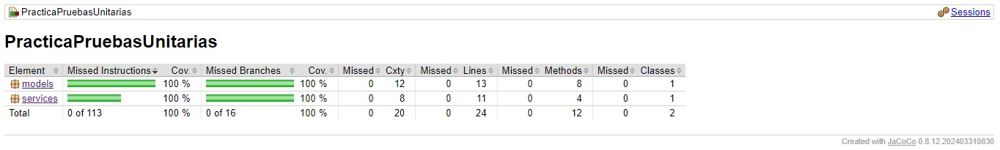

# Practicando Pruebas Unitarias con JUnit5 y Mockito

Este proyecto es un ejemplo simple y corto que demuestra cómo aplicar pruebas unitarias a las clases para comprobar su funcionalidad. Además, se utiliza Jacoco para generar un reporte de cobertura de las pruebas realizadas.

## Contenidos

- [Descripción](#descripción)
- [Requisitos](#requisitos)
- [Instalación](#instalación)
- [Uso](#uso)
- [Generación de Reporte](#generación-de-reporte)
- [Enlaces](#enlaces)

## Descripción

El objetivo de este proyecto es proporcionar una introducción práctica a las pruebas unitarias utilizando JUnit5 y Mockito. Las pruebas unitarias son fundamentales para asegurar la calidad y funcionalidad del código. Jacoco se utiliza para generar un informe visual de la cobertura de las pruebas, lo que ayuda a identificar las áreas del código que no están siendo probadas.

## Requisitos

- Java 8 o superior
- Maven 3.6.3 o superior

## Instalación

1. Clona el repositorio:
    ```bash
    git clone https://github.com/tu-usuario/tu-repositorio.git
    ```
2. Navega al directorio del proyecto:
    ```bash
    cd tu-repositorio
    ```

## Uso

1. Compila el proyecto y ejecuta las pruebas unitarias:
    ```bash
    mvn clean test
    ```

## Generación de Reporte

1. Genera el reporte de cobertura de pruebas con Jacoco:
    ```bash
    mvn jacoco:report
    ```

2. Abre el reporte generado en el navegador. El reporte estará disponible en la siguiente ruta:
    ```
    target/site/jacoco/index.html
    ```


## Enlaces

- <a href="https://junit.org/junit5/docs/current/user-guide/" target="_blank">Documentación de JUnit5</a>
- <a href="https://site.mockito.org/" target="_blank">Documentación de Mockito</a>
- <a href="https://www.jacoco.org/jacoco/trunk/doc/" target="_blank">Documentación de Jacoco</a>

---

Este proyecto es mantenido por [Anyelo Nuñez Obispo](https://github.com/AnyeloDev16).
